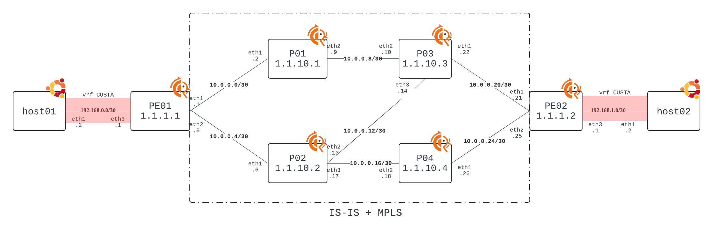
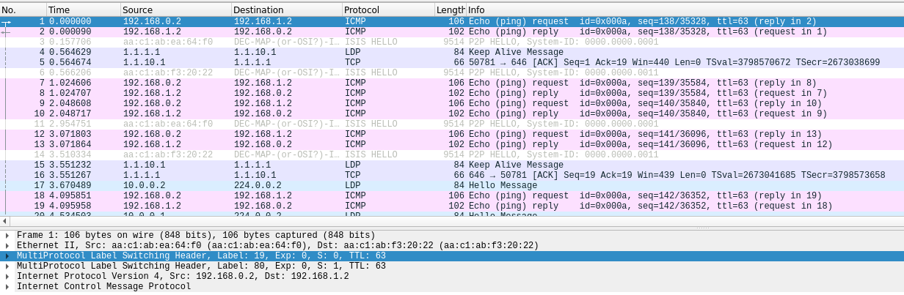

# Topology




# Containerlab install

[containerlab](https://containerlab.dev/install/)

``` 
$ sudo bash -c "$(curl -sL https://get.containerlab.dev)"
```

# Usage

※ host名なし: ホスト機, host名あり: コンテナ


host機でmplsのモジュールを追加

```
$ sudo modprobe mpls_router
$ sudo modprobe mpls_gso
$ sudo modprobe mpls_iptunnel

```

Containerlab ネットワークを作成

```
$ sudo containerlab deploy -t clab.yaml
```

状態確認

```
$ docker ps
CONTAINER ID   IMAGE                            COMMAND                  CREATED        STATUS        PORTS                                  NAMES
a99c7502ec91   frrouting/frr:latest             "/sbin/tini -- /usr/…"   16 hours ago   Up 16 hours                                          clab-mpls-p02
cf5db48d4ff6   frrouting/frr:latest             "/sbin/tini -- /usr/…"   16 hours ago   Up 16 hours                                          clab-mpls-pe01
afa44eeafaa7   frrouting/frr:latest             "/sbin/tini -- /usr/…"   16 hours ago   Up 16 hours                                          clab-mpls-p03
52782e99141f   frrouting/frr:latest             "/sbin/tini -- /usr/…"   16 hours ago   Up 16 hours                                          clab-mpls-pe02
3b6000352d23   frrouting/frr:latest             "/sbin/tini -- /usr/…"   16 hours ago   Up 16 hours                                          clab-mpls-p01
4690ba7ed823   frrouting/frr:latest             "/sbin/tini -- /usr/…"   16 hours ago   Up 16 hours                                          clab-mpls-p04
ac46ce85c709   wbitt/network-multitool:latest   "/bin/sh /docker/ent…"   16 hours ago   Up 16 hours   80/tcp, 443/tcp, 1180/tcp, 11443/tcp   clab-mpls-host01
637174b3dc1e   wbitt/network-multitool:latest   "/bin/sh /docker/ent…"   16 hours ago   Up 16 hours   80/tcp, 443/tcp, 1180/tcp, 11443/tcp   clab-mpls-host02
```

pe01に接続

```
$ docker exec -it clab-mpls-pe01 vtysh

Hello, this is FRRouting (version 8.4_git).
Copyright 1996-2005 Kunihiro Ishiguro, et al.
```

IS-ISの確認

```
pe01# show isis database
Area 1:
IS-IS Level-1 link-state database:
LSP ID                  PduLen  SeqNumber   Chksum  Holdtime  ATT/P/OL
pe01.00-00           *    114   0x00000012  0xc70b    1071    0/0/0
pe02.00-00                114   0x00000012  0xf0af    1060    0/0/0
p01.00-00                 113   0x00000012  0x907f    1018    0/0/0
p02.00-00                 133   0x00000012  0x1f6e    1123    0/0/0
p03.00-00                 133   0x00000012  0x4240    1143    0/0/0
p04.00-00                 113   0x00000012  0x01dc    1110    0/0/0
    6 LSPs
```

ルーティングテーブルの確認

```
pe01# show ip route
Codes: K - kernel route, C - connected, S - static, R - RIP,
       O - OSPF, I - IS-IS, B - BGP, E - EIGRP, N - NHRP,
       T - Table, v - VNC, V - VNC-Direct, A - Babel, F - PBR,
       f - OpenFabric,
       > - selected route, * - FIB route, q - queued, r - rejected, b - backup
       t - trapped, o - offload failure

C>* 1.1.1.1/32 is directly connected, lo, 03:54:51
I>* 1.1.1.2/32 [115/40] via 10.0.0.2, eth1, label 17, weight 1, 03:54:21
  *                     via 10.0.0.6, eth2, label 17, weight 1, 03:54:21
I>* 1.1.10.1/32 [115/20] via 10.0.0.2, eth1, label implicit-null, weight 1, 03:54:21
I>* 1.1.10.2/32 [115/20] via 10.0.0.6, eth2, label implicit-null, weight 1, 03:54:21
I>* 1.1.10.3/32 [115/30] via 10.0.0.2, eth1, label 19, weight 1, 03:54:21
  *                      via 10.0.0.6, eth2, label 19, weight 1, 03:54:21
I>* 1.1.10.4/32 [115/30] via 10.0.0.6, eth2, label 20, weight 1, 03:54:21
I   10.0.0.0/30 [115/20] via 10.0.0.2, eth1 inactive, weight 1, 03:54:21
C>* 10.0.0.0/30 is directly connected, eth1, 03:54:51
I   10.0.0.4/30 [115/20] via 10.0.0.6, eth2 inactive, weight 1, 03:54:21
C>* 10.0.0.4/30 is directly connected, eth2, 03:54:51
I>* 10.0.0.8/30 [115/20] via 10.0.0.2, eth1, label implicit-null, weight 1, 03:54:21
I>* 10.0.0.12/30 [115/20] via 10.0.0.6, eth2, label implicit-null, weight 1, 03:54:21
I>* 10.0.0.16/30 [115/20] via 10.0.0.6, eth2, label implicit-null, weight 1, 03:54:21
I>* 10.0.0.20/30 [115/30] via 10.0.0.2, eth1, label 24, weight 1, 03:54:21
  *                       via 10.0.0.6, eth2, label 23, weight 1, 03:54:21
I>* 10.0.0.24/30 [115/30] via 10.0.0.6, eth2, label 24, weight 1, 03:54:21

```

MPLSテーブルの確認

```
pe01# show mpls table
 Inbound Label  Type  Nexthop   Outbound Label
 -----------------------------------------------
 16             LDP   10.0.0.2  19
 16             LDP   10.0.0.6  17
 17             LDP   10.0.0.2  implicit-null
 18             LDP   10.0.0.6  implicit-null
 19             LDP   10.0.0.2  17
 19             LDP   10.0.0.6  19
 20             LDP   10.0.0.6  20
 21             LDP   10.0.0.2  implicit-null
 22             LDP   10.0.0.6  implicit-null
 23             LDP   10.0.0.6  implicit-null
 24             LDP   10.0.0.2  24
 24             LDP   10.0.0.6  23
 25             LDP   10.0.0.6  24
 80             BGP   CUSTA     -


```


BGPの確認

```
pe01# show bgp summary

IPv4 Unicast Summary (VRF default):
BGP router identifier 1.1.1.1, local AS number 65000 vrf-id 0
BGP table version 0
RIB entries 0, using 0 bytes of memory
Peers 1, using 717 KiB of memory
Peer groups 1, using 64 bytes of memory

Neighbor        V         AS   MsgRcvd   MsgSent   TblVer  InQ OutQ  Up/Down State/PfxRcd   PfxSnt Desc
1.1.1.2         4      65000         5         5        0    0    0 00:00:27            0        0 N/A

Total number of neighbors 1

IPv4 VPN Summary (VRF default):
BGP router identifier 1.1.1.1, local AS number 65000 vrf-id 0
BGP table version 0
RIB entries 3, using 576 bytes of memory
Peers 1, using 717 KiB of memory
Peer groups 1, using 64 bytes of memory

Neighbor        V         AS   MsgRcvd   MsgSent   TblVer  InQ OutQ  Up/Down State/PfxRcd   PfxSnt Desc
1.1.1.2         4      65000         5         5        0    0    0 00:00:27            1        1 N/A

Total number of neighbors 1

```

vrf CUSTAのルーティングの確認

```
pe01# show ip route vrf CUSTA
Codes: K - kernel route, C - connected, S - static, R - RIP,
       O - OSPF, I - IS-IS, B - BGP, E - EIGRP, N - NHRP,
       T - Table, v - VNC, V - VNC-Direct, A - Babel, F - PBR,
       f - OpenFabric,
       > - selected route, * - FIB route, q - queued, r - rejected, b - backup
       t - trapped, o - offload failure

VRF CUSTA:
C>* 192.168.0.0/24 is directly connected, eth3, 00:05:02
B>  192.168.1.0/24 [20/0] via 1.1.1.2 (vrf default) (recursive), label 80, weight 1, 00:04:27
  *                         via 10.0.0.2, eth1 (vrf default), label 17/80, weight 1, 00:04:27
  *                         via 10.0.0.6, eth2 (vrf default), label 16/80, weight 1, 00:04:27
```


ping 疎通確認(host01 -> host02)

host01に接続

```
keita@~/bof/mpls% docker exec -it clab-mpls-host01 bash
```

ping 実行
```
keita@~/bof/mpls% docker exec -it clab-mpls-host01 bash
host01:/# ping 192.168.1.2
PING 192.168.1.2 (192.168.1.2) 56(84) bytes of data.
64 bytes from 192.168.1.2: icmp_seq=1 ttl=62 time=0.375 ms
64 bytes from 192.168.1.2: icmp_seq=2 ttl=62 time=0.203 ms
64 bytes from 192.168.1.2: icmp_seq=3 ttl=62 time=0.206 ms
64 bytes from 192.168.1.2: icmp_seq=4 ttl=62 time=0.145 ms
64 bytes from 192.168.1.2: icmp_seq=5 ttl=62 time=0.179 ms

<<以下略>>
```

pe01にてtcpdump実施
```
$ docker exec -it clab-mpls-pe01 bash
bash-5.1#

```

```
bash-5.1# tcpdump -i eth1 -w ping-pe01-eth1.pcap
tcpdump: listening on eth1, link-type EN10MB (Ethernet), snapshot length 262144 bytes
^C34 packets captured
38 packets received by filter
0 packets dropped by kernel
```

wiresharkでパケットを確認

```
docker cp clab-mpls-pe01:ping-pe01-eth1.pcap .
```


